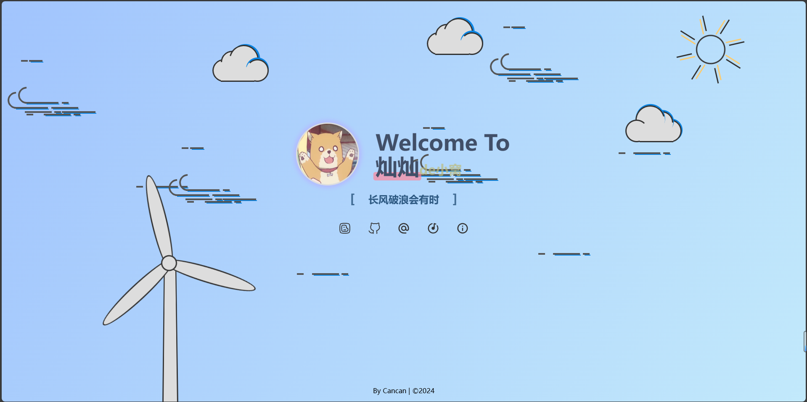

# MyHome

## 项目介绍
MyHome是关于我自己的个人主页，目前还在搭建中，后续会持续更新。
## 项目结构
```
MyHome
├── public
│   ├── favicon1.ico
|   ├── favicon2.ico
│   └── favicon3.ico
├── src
│   ├── assets
│   │   └── avatar.png
│   ├── style
│   │   ├── App.less
│   │   ├── background.less
│   │   └── load.css
|   ├── components
│   │   └── background.vue
│   ├── App.vue
|   ├── style.css
│   └── main.js
├── .gitignore
├── index.html
├── jsconfig.json
├── package-lock.json
├── package.json
├── vite.config.js
└── README.md
```
## 项目依赖
- vue
- vueuse/motion
- vuesax - alpha
- less
- iconify

## 项目预览


## 更新日志
#### -------10月9日更新-------
- 网页初具规模
###### 更新预览


#### -------10月12日更新-------
- 更改了部分样式，添加了部分内容（滚动字幕）
- 删除了部分内容（加载动画的js功能）

#### -------10月15日更新-------
- 添加了部分内容（滚动个性签名、a标签图标）
- 更改了部分样式（滚动字幕、a标签图标、部分文字颜色）
- 重新添加了部分内容（优化后的加载动画的js功能）
- 将背景独立出来成为一个组件
###### 更新预览
